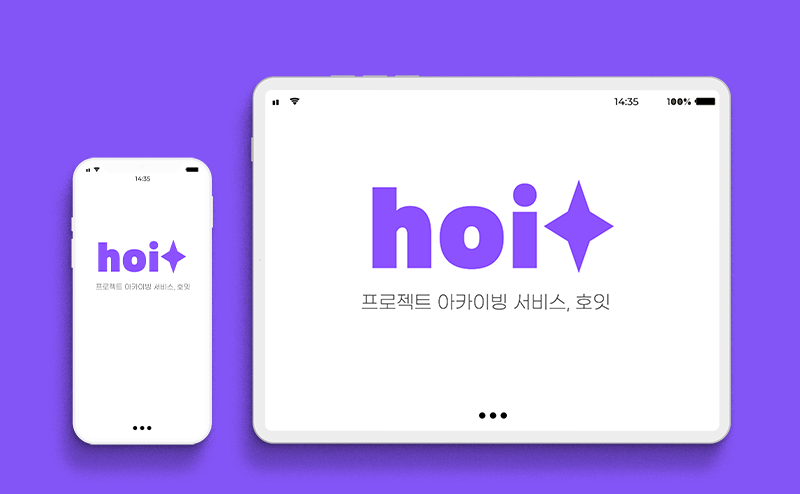
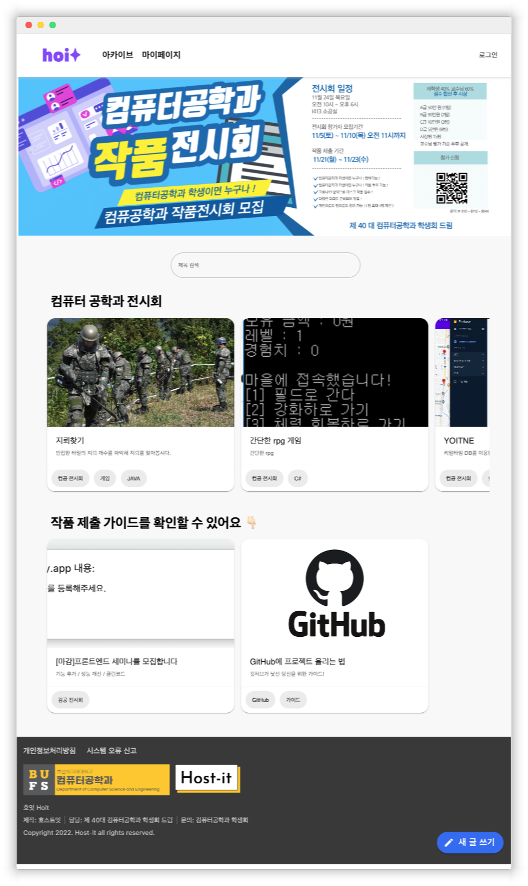
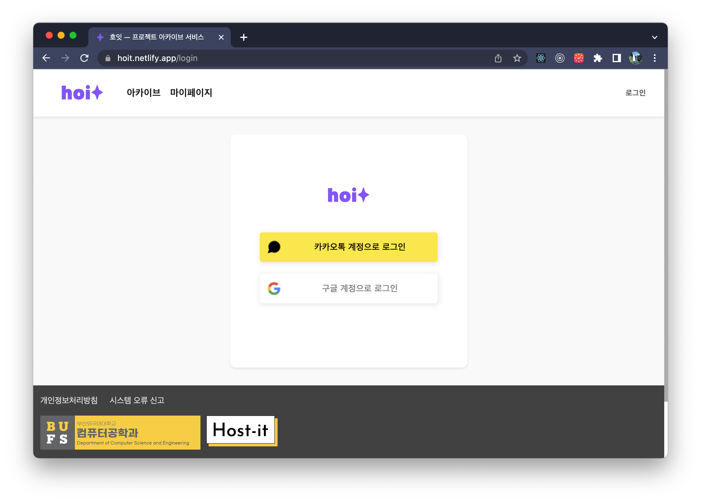
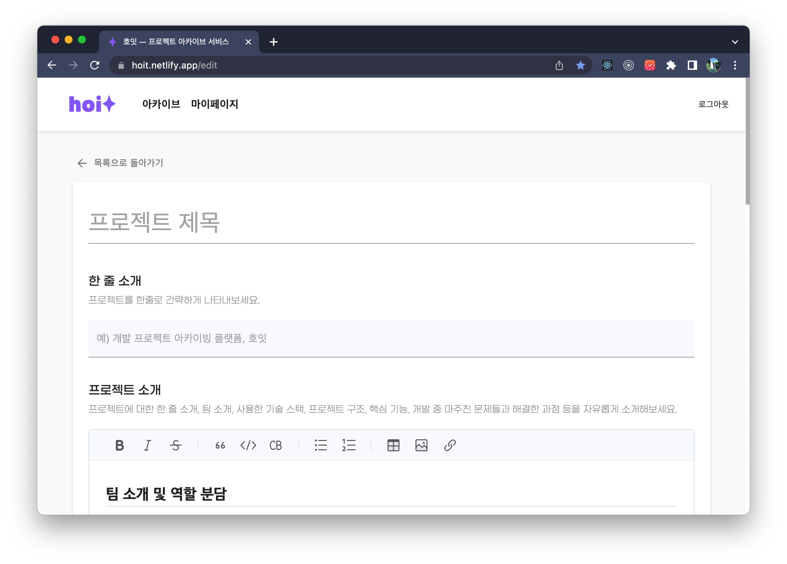
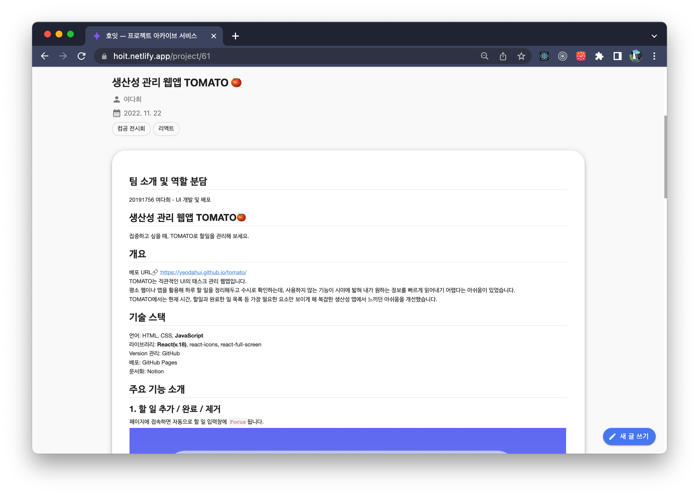
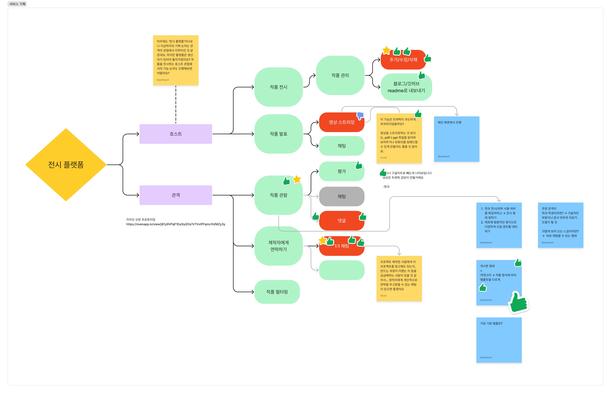
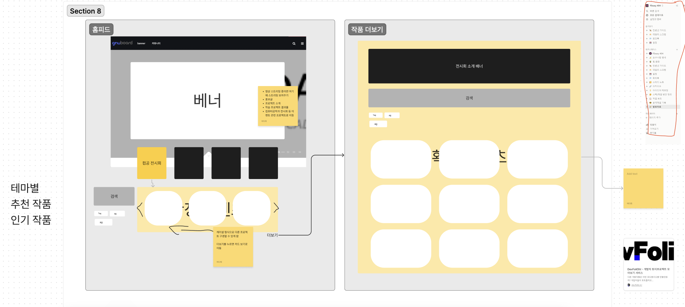
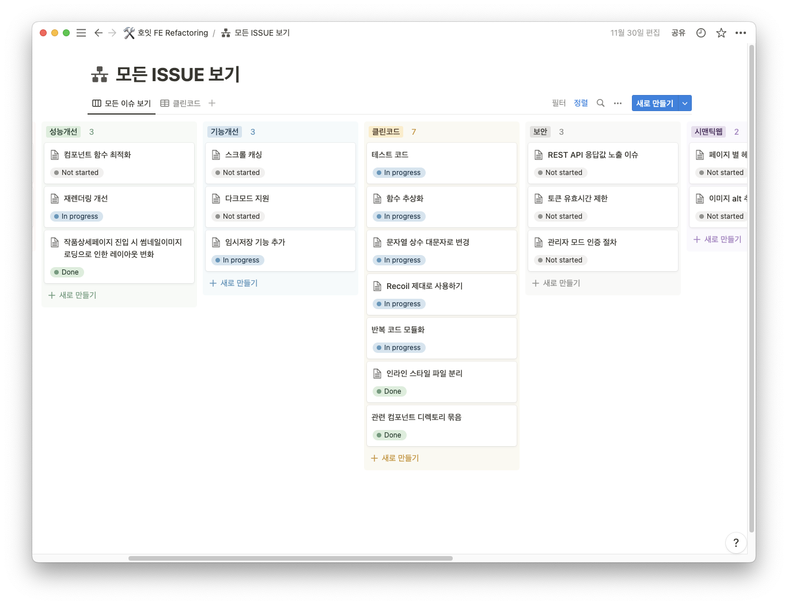
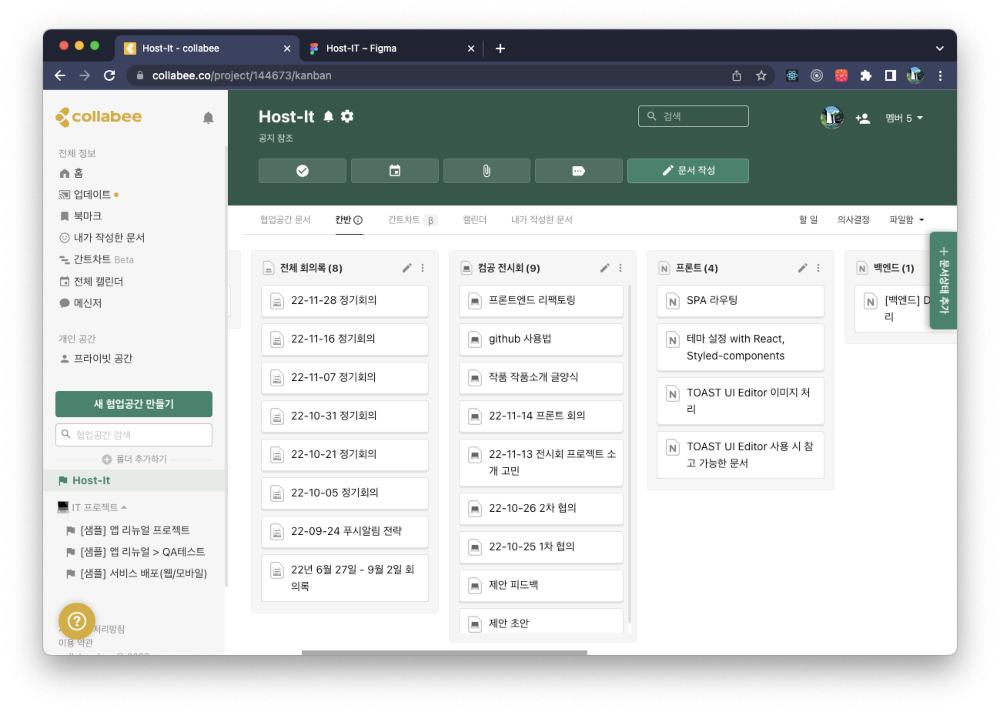

# 프로젝트 아카이빙 서비스, 호잇


## 0. 이 프로젝트에 참여하기
이 프로젝트는 Create React App으로 부트스트랩되었습니다.

### 설치
이 repository를 복제하여 CLI에서 다음과 같이 npm 명령을 입력합니다.
```
npm i
npm start
```

## 1. 프로젝트 소개
> *“다른 사람들은 어떤 프로젝트를 했을까?”*
> 

**호잇 hoit**은 다른 사람들이 만든 프로젝트를 모아보고 프로젝트 제작자에게 직접 연락할 수 있는 프로젝트 아카이빙 웹 서비스입니다.

- 내 프로젝트를 다른 사람들에게 소개하고, 피드백을 받아보세요.
- 템플릿을 활용해 프로젝트 소개를 간편하게 작성하세요.
- 마음에 드는 프로젝트의 URL을 공유해보세요.
- 궁금한 점을 프로젝트 제작자에게 물어보세요.



### Front-End 개발 환경
- Create React App
- React v18
- Recoil v0.7.6
- Meterial UI, styled-components
- react-router-dom v6
- Cloudinary

### 디렉토리 구조
```
📦src
 ┣ 📂api // Http Request 관련 API
 ┣ 📂assets // image, font 등 자료
 ┣ 📂atom // recoil 전역 상태
 ┣ 📂components
 ┣ 📂hooks // 커스텀 hook
 ┣ 📂pages
 ┃ ┣ ...
 ┃ ┗ 📜Routes.jsx // 라우터
 ┣ 📂styles
 ┃ ┣ 📜global.js // 전역 스타일 설정
 ┃ ┣ 📜style.js // 자주 사용되는 스타일 정의
 ┃ ┗ 📜theme.js // 스타일 테마 정의
 ┣ 📂template
 ┃ ┗ 📜PageTemplate.jsx // pages에서 사용되는 페이지 레이아웃 템플릿
 ┣ 📂util // 재사용되는 함수
 ┣ 📜App.jsx
 ┣ 📜index.js
```


### 주요 기능
- 👤 **소셜로그인을 이용한 로그인/회원가입**
    

- ✏️ **내 프로젝트 등록 / 수정 / 삭제하기**
    
- 🖼️ **프로젝트 소개 조회하기**
    
- 🔍 **프로젝트 제목 검색하기**
   
    

### 버전
- `1.0`
    - 2022년 11월 24일 개최된 **부산외국어대학교 컴퓨터공학과 프로젝트 전시회**와 연계한 시범운영
- `1.1`
    - 코드 유지보수성 개선
    - 웹페이지 성능 개선
    - 글 작성 시 임시저장 기능 추가

## 2. 팀원 소개

---

| 이름 | 김선화(Leader) | 여다희 | 고현규 | 양성욱 |
| --- | --- | --- | --- | --- |
| GitHub | https://github.com/kmseonhwa | https://github.com/yeodahui | https://github.com/Hamtoto | https://github.com/Pepe6bf |
| 역할 | 기획, 프론트엔드 | 기획, 프론트엔드 | 기획, UI/UX 디자인 | 기획, 백엔드 |

## 3. 프로젝트 진행 과정

---

### 3-1. 기획 및 디자인

- FigJam을 활용해 “프로젝트 전시 플랫폼”이라는 테마 아래에서 필요한 기능을 구상, 어떤 UI가 구현되어야 하는지에 관한 기획 회의를 진행


플랫폼 UI 와이어프레임

### 3-2. 백엔드 개발
- **Back-end repository:** https://github.com/host-IT-Project/exhibition-platform-backend
- 개발 환경:
    - IntelliJ IDEA Ultimate 2022.1.3
    - Java 17
    - Gradle 7.4.1
    - Spring Boot 2.7.3
- 기획을 배경으로 ERD 설계
    - 게시글, 게시글 해시태그, 카테고리, 사용자 등 데이터구조 설계 및 구현    
- 게시글 CRUD 가능한 REST API 제작, 프론트엔드에서 테스트 가능하도록 POSTMAN 파일 작성하여 제공

### 3-3. 프론트엔드 개발
- **Front-end repository:** https://github.com/host-IT-Project/frontend
- 개발 환경:
    - Visual Studio Code
    - JavaScript ES6
    - React 18.2.0
    - Recoil 0.7.6
- 기획 및 디자인을 반영해 UI 컴포넌트를 구성
- 백엔드에서 제공한 Request API를 이용해 사용자가 편하게 기능을 활용할 수 있도록 화면을 구성

### 3-4. 서비스 배포 및 모니터링
- 2022년 11월 21일부터 컴퓨터공학과 전시회 작품소개 제출 시작
- 제출일에 맞춰 프론트엔드 배포
- 서비스 기간 동안 발생하는 버그 수정

### 3-5. 코드 리팩토링

- 같은 분야에 관심이 있는 다른 개발자들을 모집해, 함께 프로젝트를 살펴보며 문제점을 발견하고 수정한 과정을 발표하는 **세미나**를 기획
    
    - 앞으로 서비스를 확장할 수 있도록 코드의 유지보수성을 높이거나, 웹 성능을 개선하는 등의 활동을 진행함(관련문서: [호잇 FE Refactoring](https://www.notion.so/FE-Refactoring-266950d7fd154506b4a882b83c9fa63e?pvs=21) )

## 4. 해결한 문제와 느낀 점

---

### 협업을 위한 문서화

기획이 마무리되어야 백엔드가 ERD 설계를 할 수 있고, 디자인 작업이 끝나야 프론트엔드가 UI 구현을 할 수 있어 각 작업이 유기적으로 연결되어있었기 때문에 팀원간의 소통이 매우 중요했습니다.
처음에는 소통의 대부분을 채팅으로 진행했으나, 작업이 쪼개지고 동시에 진행되는 것이 많아지다보니 작업을 추적하기 쉽지 않았습니다. 그래서 실무에서 사용되는 협업툴 Collabee, Notion을 도입해 각자의 할일과 작업들을 문서로 남기기 시작했습니다.
내 작업 중 다른 사람의 작업에 영향을 미칠 수 있는 요소들, 앞으로의 작업에 필요한 요구사항 등을 문서로 정리하니 서로 여러 번 되묻거나 채팅내역을 찾아 스크롤을 죽죽 올릴 필요가 없어 편리했습니다. 소통에 드는 비용을 줄이니 작업속도도 빨라지고, 내 역할을 수행하며 다른 팀원들이 필요할 법한 정보들을 생각하는 습관을 익힐 수 있었습니다.




### 유지보수를 위한 코드 개선

컴퓨터공학과 전시회와 연계한 행사를 성공적으로 마무리한 뒤 같은 전시를 내년에 진행해도 이 서비스를 이용하고 싶다는 요청을 받았습니다. 팀원 중 한 명이 내년이면 졸업을 할 예정이었기에, 앞으로 새로운 개발자를 영입해 유지보수에 참여할 수 있도록 지금까지 만들어진 프로젝트 구조와 코드를 좀더 보기 쉽고 고치기 쉽도록 개선하는 기간을 일주일간 가졌습니다.

서비스 공개에 맞춰 “일단 프로그램이 돌아가게 만드는 것”을 최우선으로 개발을 급하게 진행하다 보니 코드가 읽기 어렵고, 구조가 복잡하고, 서비스 환경이 안정적이지 못한 문제들이 많았습니다.
그래서 팀원 중 몇 명이 로버트 C. 마틴의 책 “Clean Code 클린 코드” 스터디에 참여해 코드 가독성을 개선하는 법을 학습했고, 스터디를 통해 얻은 지식을 우리 프로젝트에 적용해보았더니 점진적으로 읽기 좋은, 유지보수성이 좋은 코드로 변화해나갔습니다.
이 경험을 통해 개발은 마감 기한을 지키는 것 역시 중요하지만, 개발 이후의 유지보수 비용을 줄이기 위해서는 평상시 많은 코드들을 읽어보고 좋은 코드를 짜는 법을 공부해야 한다는 것을 깨달을 수 있었습니다.
